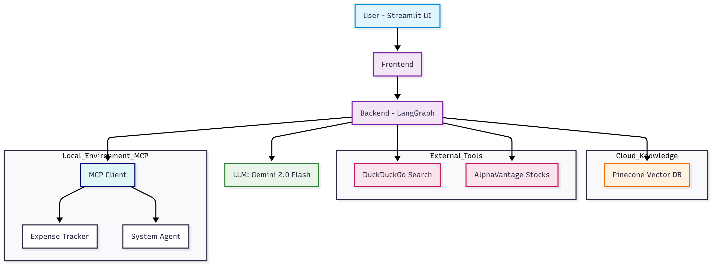

# Talos: The Agentic RAG System

Talos is an advanced AI Assistant that bridges the gap between **Cloud Intelligence** and **Local Execution**. Built on **LangGraph**, it orchestrates complex workflows by combining **Retrieval Augmented Generation (RAG)** using **Pinecone** with local system control via the **Model Context Protocol (MCP)**.

Powered by **Google Gemini 2.0 Flash**, Talos is not just a chatbot—it's an **agent** that can read your documents, manage your expenses, check your system vitals, and browse the web, all in one stateful session.

## Key Features

- **Agentic Orchestration (LangGraph)**  
  Unlike simple linear chains, Talos uses a graph-based state machine. It can loop, decide to use tools, retry operations, and maintain conversation history in memory.

- **Model Context Protocol (MCP)**  
  Integrates with local Python servers to perform real-world actions:

  - **System Agent**: Monitors local CPU/RAM usage
  - **Expense Tracker**: Logs financial data into a local database

- **Persistent RAG (Pinecone)**  
  Uploaded PDFs are vectorized (using `text-embedding-004`) and stored in Pinecone (Cloud). Your knowledge base survives server restarts.

- **Multi-Tool Capability**

  - Web Search: DuckDuckGo integration for real-time info
  - Financial Data: AlphaVantage API for stock market tracking
  - Calculator: Robust mathematical operations

- **Observability (LangSmith)**  
  Full end-to-end tracing of agent steps, tool calls, and LLM reasoning for debugging and optimization.

## Architecture



## 📂 Project Structure

textTalos/
├── backend.py # Core LangGraph logic, Tool definitions, and Pinecone setup
├── frontend.py # Streamlit UI with Async streaming and visual tool status
├── server.py # Local MCP Server (Expense Tracker & System Monitor)
├── requirements.txt # Python dependencies
├── .env # API Keys and Secrets
└── README.md # Documentation

### 1. Clone the Repository

```bash
git clone https://github.com/yourusername/talos.git
cd talos
```

## Configure Environment Variables

Create a .env file in the root directory:

```bash
env# Google Gemini (LLM)
GOOGLE_API_KEY="your_gemini_api_key"

# Pinecone (Vector Database)
PINECONE_API_KEY="your_pinecone_api_key"

# LangSmith (Tracing & Debugging)
LANGCHAIN_TRACING_V2=true
LANGCHAIN_ENDPOINT="https://api.smith.langchain.com"
LANGCHAIN_API_KEY="your_langsmith_api_key"
LANGCHAIN_PROJECT="talos-agent"

# Tools
ALPHAVANTAGE_API_KEY="your_alphavantage_key"
```
